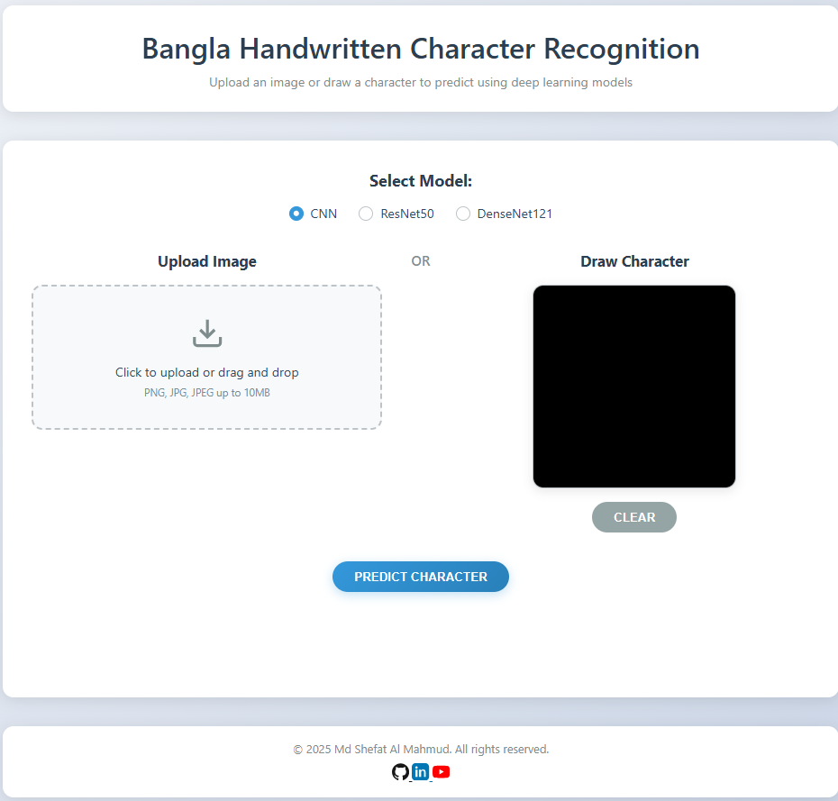
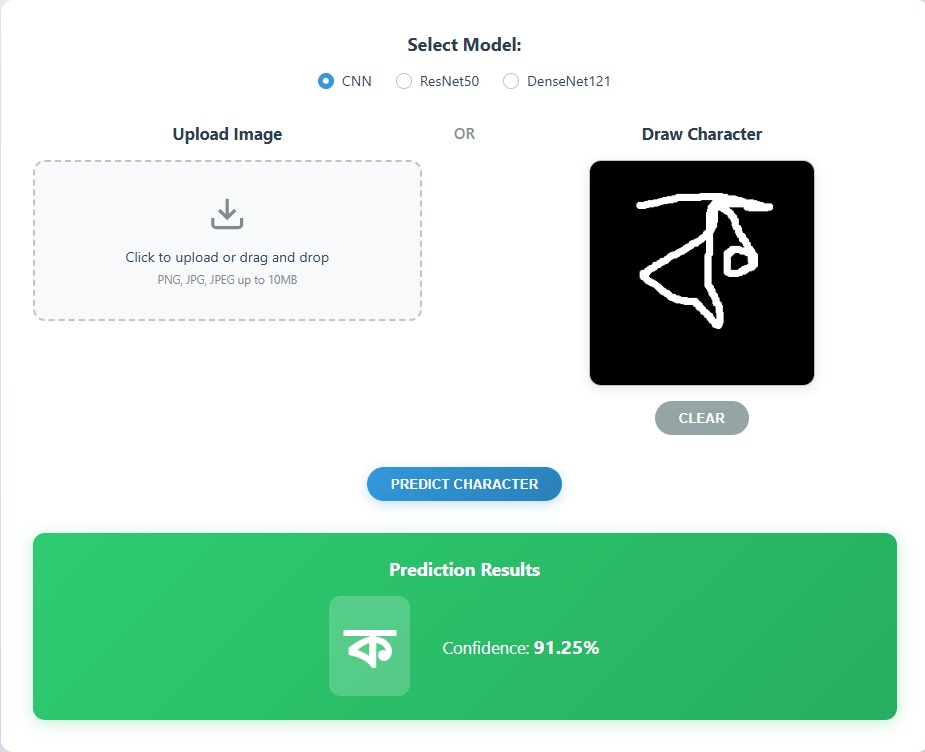
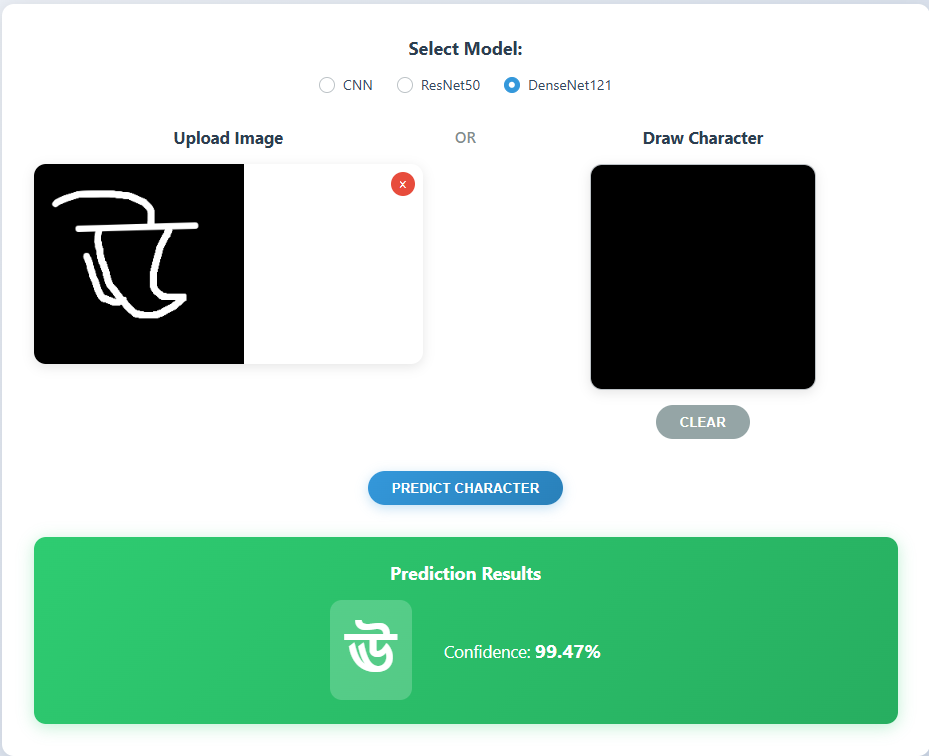

# Bangla Handwritten Character Recognition Web App

A Flask web application for predicting Bangla handwritten characters using deep learning models.

## App UI Screenshots

Below are screenshots of the Bangla Handwritten Character Recognition Web App:

<p align="center">
    
</p>
<p align="center">
    
</p>
<p align="center">
    
</p>

## Features

- **Multiple Models**: Choose between CNN, ResNet50, and DenseNet121
- **Dual Input Methods**: Upload images or draw characters on canvas
- **Real-time Prediction**: Get instant predictions with confidence scores
- **Mobile Friendly**: Responsive design that works on smartphones and tablets
- **60 Character Classes**: Supports all Bangla vowels, consonants, and digits (০-৯)

## Setup Instructions

### 1. Install Dependencies

```bash
# Create virtual environment
python -m venv venv

# Activate virtual environment
# On Windows:
venv\Scripts\activate
# On macOS/Linux:
source venv/bin/activate

# Install requirements
pip install -r requirements.txt
```

### 2. Add Your Models

Place your trained model files in the `models/` directory:

```
models/
├── cnn_model.keras
├── resnet50_model.keras
└── densenet121_model.keras
```

**Important**: Your models should be saved in Keras format (.keras) and expect:
- **CNN Model**: 32x32 grayscale images (shape: 1, 32, 32, 1)
- **ResNet50/DenseNet121**: 32x32 RGB images (shape: 1, 32, 32, 3)

### 3. Run the Application

```bash
python app.py
```

The application will be available at: `http://localhost:5000`

## Model Requirements

Your models should:
1. Be trained on 60 Bangla character classes
2. Accept preprocessed images as described above
3. Output predictions for classes in this order:
   - Vowels: অ, আ, ই, ঈ, উ, ঊ, ঋ, এ, ঐ, ও, ঔ
   - Consonants: ক, খ, গ, ঘ, ঙ, চ, ছ, জ, ঝ, ঞ, ট, ঠ, ড, ঢ, ণ, ত, থ, দ, ধ, ন, প, ফ, ব, ভ, ম, য, র, ল, শ, ষ, স, হ, ড়, ঢ়, য়, ৎ, ং, ঃ, ঁ
   - Digits: ০, ১, ২, ৩, ৪, ৫, ৬, ৭, ৮, ৯

## API Endpoints

### POST /predict
Predict a character from an image.

**Request Body:**
```json
{
    "image": "data:image/png;base64,iVBORw0KGgoAAAANSUhEUgAA...",
    "model": "densenet121"
}
```

**Response:**
```json
{
    "success": true,
    "prediction": "অ",
    "confidence": 96.68,
    "model_used": "densenet121"
}
```

### GET /health
Check application and model status.

**Response:**
```json
{
    "status": "healthy",
    "models_loaded": {
        "cnn": true,
        "resnet50": true,
        "densenet121": true
    }
}
```

## Deployment

### Azure App Service

1. Create a `Dockerfile`:
```dockerfile
FROM python:3.11-slim

WORKDIR /app
COPY requirements.txt .
RUN pip install -r requirements.txt

COPY . .
EXPOSE 5000

CMD ["python", "app.py"]
```

2. Deploy to Azure App Service using your $100 credit
3. Upload your model files to the deployed application

## File Structure

```
bangla_ocr_web_app/
├── app.py                 # Main Flask application
├── requirements.txt       # Python dependencies
├── README.md             # This file
├── models/               # Directory for your .keras model files
│   ├── cnn_model.keras
│   ├── resnet50_model.keras
│   └── densenet121_model.keras
├── templates/
│   └── index.html        # Main HTML template
└── static/
    ├── css/
    │   └── style.css     # Stylesheet
    └── js/
        └── script.js     # Frontend JavaScript
```

## Author

**Md Shefat Al Mahmud**

## License

This project is for educational and research purposes.

